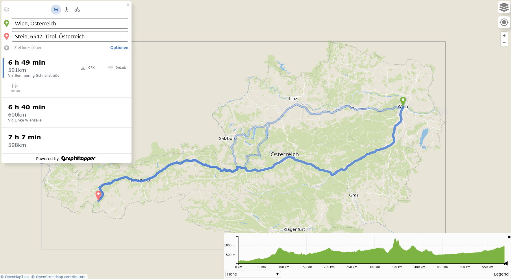

# Overview

Local Maps has it all locally.

The web UI and the routing is from [GraphHopper](https://github.com/graphhopper/graphhopper), the address search
is from [photon](https://github.com/komoot/photon/) and the tiles are created by 
[planetiler](https://github.com/onthegomap/planetiler) and served by [tilesserver-gl](https://github.com/maptiler/tileserver-gl/).

# Features

 * local map tiles
 * local routing for three profiles: car, foot and bike (configurable)
 * routing considers elevation data
 * local address search (auto complete)
 * powered by OpenStreetMap data
 * maps shows different data along the route (elevation, road class, surface, ...)
 * alternative routes
 * with minor tweak navigation in maps possible

# Installation

1. edit .env and use the data you want or just start with the default (Austria)
2. `docker compose up --build` 
3. wait and ensure all services are properly started:
   1. graphhopper should say `"... INFO org.eclipse.jetty.server.Server - Started Server..."`
   2. planetiler should be finished and say `"local-maps-planetiler-1  ... Acknowledgments"`
   3. photon should say `"... de.komoot.photon.App - ES cluster is now ready"`
   4. geocoder-converter should say `"... org.eclipse.jetty.server.Server: Started..."`
   5. tileserver should say `"Listening at http://[::]:8080/"`
   6. ui should say `"Loopback: http://localhost:3000/"`
4. View GraphHopper Maps at http://localhost:3000

The step 2 is rather demanding as all files and images are downloaded and built in
parallel. You can reduce demand if you start them one by one using:

`docker compose up --build <service>`

Ensure that you consider the dependencies: `planetiler, tilerserver, graphhopper, photon, geocoder-converter, ui`.

# Development

Start over:

1. `docker compose down -v`
2. `docker compose down --rmi all`

# System Requirements

To be determined. Larger installations need especially more RAM. Increase
the -Xmx settings for graphhopper and planetiler with larger areas.

Although the docker images are tuned towards small disk usage they are
still too heavy in my opinion (~200MB each). And although we already
use tileserver-gl-light this image uses over 440MB. Hopefully we can improve
this as currently you need 1800MB for the 6 docker images alone. Plus size
for the PBF and geocoding data (3GB on disk, Austria only). Plus the internal 
data for graphhopper and planetiler (1GB on disk, Austria only).

# License

Apache License 2.0 